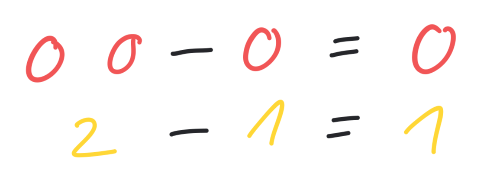

## Subtraktion

Die Subtraktion (von lat. subtrahere „wegziehen“, „entfernen“), umgangssprachlich auch Minus-Rechnen genannt, ist eine der vier Grundrechenarten der Arithmetik. Unter der Subtraktion versteht man das Abziehen einer Zahl von einer anderen. Mathematisch handelt es sich bei der Subtraktion um eine zweistellige Verknüpfung. Die Subtraktion ist die Umkehroperation der Addition. Das Rechenzeichen für die Subtraktion ist das Minuszeichen „−“.

[Wikipedia](https://de.wikipedia.org/wiki/Subtraktion)

