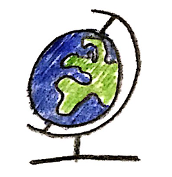
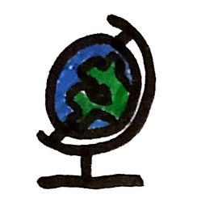
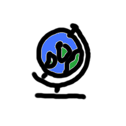
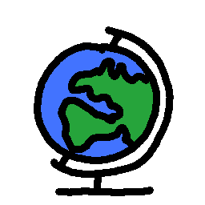

# Inhalte erstellen

Kurzanleitung für das Textformat Markdown. Eine einfache Sprache zur Formatierung von Texten mit Überschriften, Absätzen, Links, Bildern, Listen, Videos und Aufgaben.

Es braucht nicht viel, um einen Kurs zu erstellen. Einfache Texte lassen sich bereits mit Handy oder Tablet erstellen. Zum Erstellen von Videos reichen schon Papier, Stift und Handy oder eine einfache App wie ExplainEverything.


## Bilder - Stift, Papier, Handy, Tablet

Meine ersten Experimente habe ich mit Stift und Papier gemacht und die Bilder und Skizzen mit der App CamScanner abfotografiert und schnell und einfach optimiert. Auf diese Weise mache ich auch heute noch gern Skizzen, weil das Malen damit am natürlichsten ist.





Aktuell probiere ich gerade mit einem digitalen Stift Skizzen am Tablet mit Gimp aus. Die Farben wirken insgesamt ruhiger und man braucht so kein Papier mehr.






## Video

Es gibt zahlreiche Möglichkeiten Videos und Bilder zur Erläuterung von Sachverhalten zu erstellen. Der Aufwand kann mit den richtigen Ansätzen bereits verschwinden gering sein.

Je nach Fach und Art der Darstellung gibt es entsprechend einfache Lösungen:
* Skizzen mit Erklärung -> ExplainEverything App
* Programme am Computer mit Erklärung -> QuickTime
* Sport, Experimente in Chemie, Physik, Biologie etc. -> Smartphone/Kamera mit Stativ

### Präsentationen am Tablet erstellen - Explain Everything

Mit ExplainEverything lassen sich einfach und hochwertige Präsentationen mit Skizzen/Zeichnungen und fertigen Bildern als Videos am Tablet aufnehmen und bei YoutTube hochladen.

Beispiel

[video: howto mit handy abgefilmt]
[video: ergebnis aus explain everything]

### Videos - Versuche, Übungen und Lösungen

...

Der Inhalt dieser Einheit kann zum Testen beliebig geändert werden. Mit dem nächsten Laden dieser Seite werden die ursprünglichen Inhalte wieder hergestellt.

# Erste Überschrift
## Zweite Überschrift
### Dritte Überschrift

Ein Absatz.

> Zitat

    Ein Code-Schnipsel
        mit Einrückung

```
Ein anderer Schnipsel
    mit Einrückung
```

Dies ist ein Text.

* Liste 1
* Liste 2

Dies ist ein anderer Text.

1. Number 1
2. Number 2

In Link [Mathematik](https://de.wikipedia.org/wiki/Mathematik) in einem Text.

Image


Video Version 1 mit youtu.be
[](https://youtu.be/wI4Orc1MtKM)

Video Version 2 mit www.youtube.com
[](https://www.youtube.com/watch?v=wI4Orc1MtKM)

Video Version 3 mit youtube und key
[youtube](wI4Orc1MtKM)


PDF
[CC Leitfaden](https://irights.info/wp-content/uploads/userfiles/CC-NC_Leitfaden_web.pdf)

### Aufgaben

[[

Aufgabe

]]((
Lösung
))

[[

Male das Haus vom Nikolaus


]]((

Die Lösung sieht so aus ...

* Beginne in einer Ecke, die eine ungerade Anzahl von Kanten verbindet!

))

[[Aufgabe]]((Lösung))


...


*Wenn ihr andere, interessante und vielleicht bessere Ideen habt, dann schickt mir bitte eine kurze Notiz dazu - ich aktualisiere die Seiten gern, da viele davon profitieren können.*
