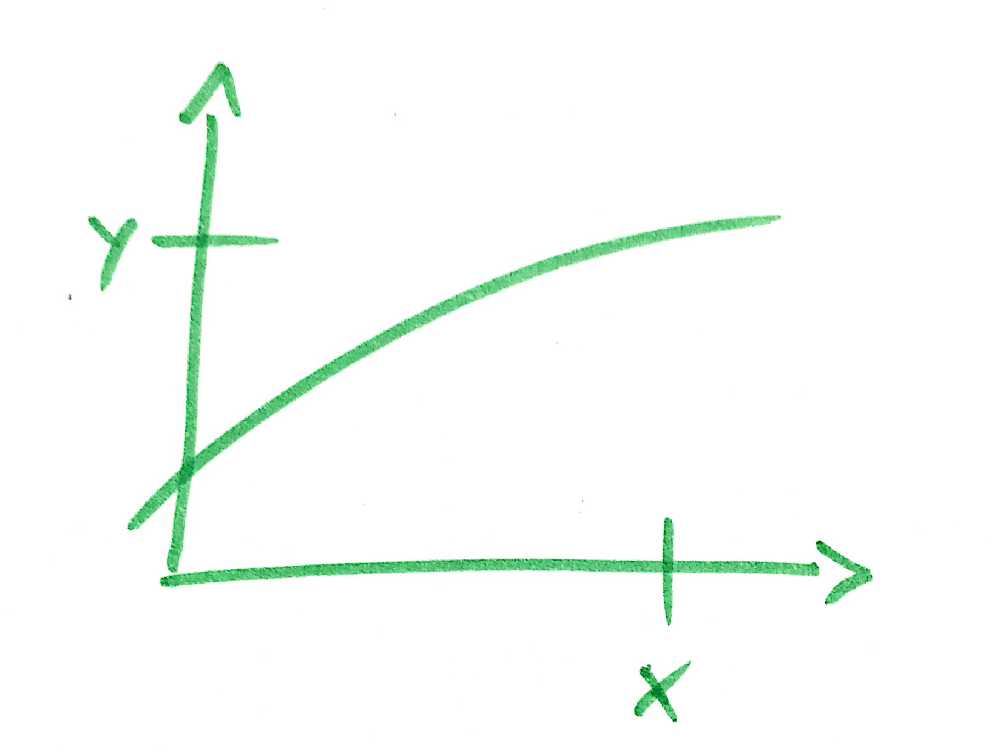

Ein Fach - Ein Titel - /bilder/pictogram2.jpg
---
## Eine Überschrift

Ein Absatz.

In der ersten Einheit sind die derzeit möglichen Formatierungen einmal demonstriert.

---
[Eine Einheit](unit.md){bilder/pictogram.jpg}
